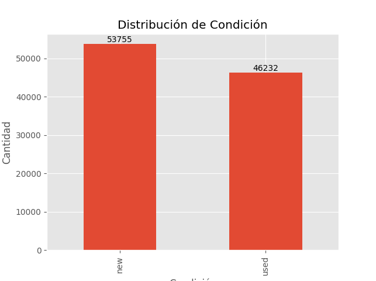

# Exploración de Datos (EDA)
Realizar un análisis exploratorio se usa con el objetivo de lograr un entendimiento más amplio del conjunto de datos, y al final se afianzarán los conocimientos detrás de la lógica del negocio; y visto de un punto de vista más técnico ayudará también en la limpieza y la construcción del modelo.
Para el siguiente análisis exploratorio se tuvieron en cuenta las siguientes variables:

-   **Condition (Variable objetivo):**, indica si el producto es nuevo o usado)
-	**Price:** precio del producto
-	**Listing_type_id:** Tipo  de publicación para los artículos; toma los valores de free, silver, bronce, gold, gold_special, gold_premium y gold_pro
-	**Automatic_relist:** Reventa automática, toma los valores de 0 y 1
-	**Status:** Estado de la publicación, toma los valores: active, paused y closed
-	**Available_quantity:** Cantidad disponible
-	**Initial_quantity:** cantidad inicial
-	**Sold_quantity:** cantidad vendida
-	**Count_seller_id:** cantidad de articulos vendidos por cada seller_id

## Análisis descriptivo

### Variable objetivo

Para entender la distribucion de productos nuevos y usados se tiene que el **53% (53.755)** de los productos son nuevos.



### General
Realizar un análisis descriptivo es lo inicial que se recomendaría realizar para entender a primera vista la districión de las variables númericas.

Para este análisis usar el método descriptivas() de la clase EDA; que se encuentra en el modulo eda.py

```python
instanciaEDA.descriptivas()
```

|       | price        | initial_quantity | sold_quantity | available_quantity |
|-------|--------------|------------------|----------------|---------------------|
| count | 99987.0      | 99987.000000     | 99987.000000   | 99987.000000        |
| mean  | 5094.341     | 34.997610        | 2.397302       | 34.746587           |
| std   | 46069.000    | 419.922783       | 42.687843      | 419.654162          |
| min   | 0.84         | 1.000000         | 0.000000       | 1.000000            |
| 25%   | 90.0         | 1.000000         | 0.000000       | 1.000000            |
| 50%   | 250.0        | 1.000000         | 0.000000       | 1.000000            |
| 75%   | 800.0        | 2.000000         | 0.000000       | 2.000000            |
| max   | 3956000.0    | 9999.000000      | 8676.000000    | 9999.000000         |


### Agrupado

Debido a que nuestra variable objetivo es codición debemos de realizar un análisis con respecto a esta variable:

#### Precio

| condition | price Q1 | price Mediana | price Promedio | price Desviación | price Q3 |
|-----------|----------|----------------|-----------------|------------------|-----------|
| new       | 140.0    | 350.0          | 3229.513445      | 38653.606948     | 999.0     |
| used      | 65.0     | 150.0          | 7262.617919      | 53330.463953     | 550.0     |

Se evidencia en general que el precio de los productos usados es mas bajo que el de los productos nuevos; aunque la media en los usados es mucho mas alta (7.262) esto es gracias a la alta dispersión de los datos; y para estos casos es mejor interpretar la mediana.

El **50%** de los productos **usados** tiene un costo de hasta **150**, mientras que en los productos nuevos el **50%** es hasta de **140**.

#### Cantidad Inicial

| condition | initial_quantity Q1 | initial_quantity Mediana | initial_quantity Promedio | initial_quantity Desviación | initial_quantity Q3 |
|-----------|---------------------|---------------------------|----------------------------|------------------------------|----------------------|
| new       | 1.0                 | 2.0                       | 63.555632                  | 570.486538                   | 10.0                 |
| used      | 1.0                 | 1.0                       | 1.792546                   | 30.043514                    | 1.0                  |

El **50%** de los productos nuevos se inician con hasta 2 productos, y en **promedio** la cantidad de productos con los que se inicia es **63.5**.

El **50%** de los productos usados se inician con hasta 1 producto, y en **promedio** la cantidad de productos con los que se inicia es **1.7**.


