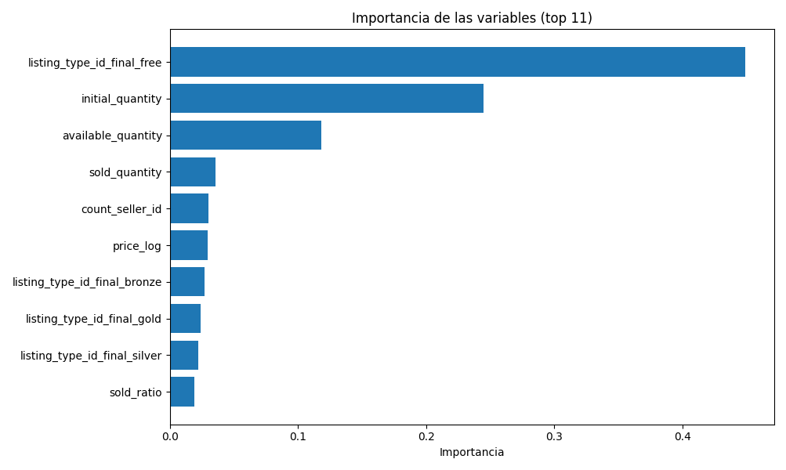

# Variables a incluir

Las variables que se seleccionaron para entrar en el modelo debido a que tuvieron mejor desarrollo en el análisis exploratorio y las pruebas fueron las siguientes:

- condition
- listing_type_id_final
- initial_quantity
- sold_quantity
- available_quantity
- sold_ratio = sold_quantity/initial_quantity
- price_log = log(price)
- count_seller_id

# Modelos

Para realizar la predicción de si un producto es nuevo o usado se usaron los siguientes modelos para el entrenamiento:

- Logistic Regression
- Random Forest
- Gradient Boosting
- XGBoost
- LightGBM

En la etapa de entrenamiento el que mejor desempeño obtuvo fue el modelo **XGBoost** con un accuracy de **0.8569**

# Ajuste de hiperparámetros

Dado a que el mejor modelo en el entrenamiento fue **XGBoost** se procedió a realizar optimización de hiperparámetros por medio de la validación cruzada de busqueda aleatorio (RandomizedSearchCV), aunque el accuracy se mantuvo constante en la optimización.

El mejor modelo fue guardado en la carpeta models.