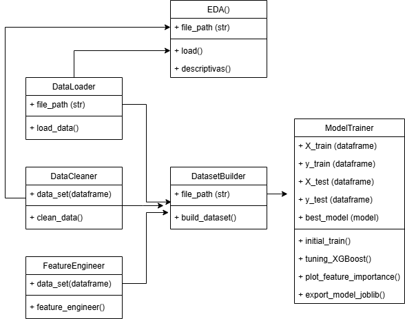

# Patrón de diseño

Construir proyectos de Machine Learning (ML) en base a patrones de diseño es una práctica fundamental para lograr reutilización, estandarización, legibilidad, mantenibilidad y eficiencia en el desarrollo de soluciones. Los patrones de diseño son soluciones probadas y documentadas a problemas comunes en ingeniería de software, y su aplicación en proyectos de ML ofrece múltiples beneficios

Por lo anterior se usó un patrón de diseño llamado **Pipeline de procesamiento** 

- **Propósito:**  Organizar el flujo de transformación de datos (limpieza, extracción de características, normalización)
- **Caso de uso:** 
  - **DataLoader():** Cargar los datos
  - **DataCleaner():** Realiza limpieza de datos
  - **Feature Engineer():** Crea nuevas variables y se seleccionan las variables finales
  - **DatasetBuilder():** Toma las clases DataLoader, DataCleaner y FeatureEnngineer para crear los datos de entrenamiento y prueba
  - **ModelTrainer():** Entrena el modelo, realiza ajuste de hiperparametros, grafica la importancia de las variables y exporta el modelo.
  - **EDA():**: Crea descriptivas y graficas basicas exploratorias

